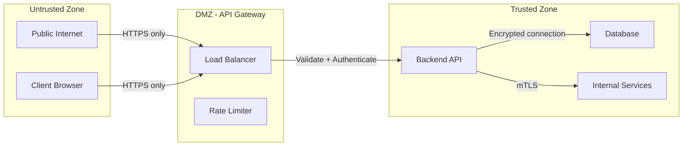

# Architect Agent - Edge Cases & Failure Modes

**Agent:** architect-agent
**Model:** Opus (read-only)
**Tools:** Read, Grep, Glob, TodoWrite
**Severity Levels:** 🔴 Critical | 🟠 High | 🟡 Medium | 🟢 Low

---

## Agent Overview

architect-agent is a **read-only planning and design agent** using Opus model for complex reasoning. Its job is to create architectural blueprints, NOT to implement code.

### Key Constraint
**❌ CANNOT:** Write, Edit, or execute Bash commands
**✅ CAN:** Research codebase, create plans, document decisions

---

## 1. DESIGN QUALITY FAILURES

### 🔴 EC-ARCH-A01: Over-Engineering
**Problem:** Creates unnecessarily complex architecture for simple requirements.

**Scenario:**
```
User: "Build a simple blog"
architect-agent designs:
- Microservices architecture
- Event sourcing
- CQRS pattern
- Kubernetes cluster
- Service mesh
[MASSIVE OVER-ENGINEERING for a blog]
```

**Root Cause:** Opus model loves complex patterns without considering project scale.

**Fix:**
```markdown
# .claude/agents/architect-agent.md
## Design Principles (UPDATED)
Before proposing architecture:
1. **Ask about scale**: "How many users? How many requests/second?"
2. **Start simple**: Recommend monolith for <10k users, microservices only for >100k
3. **YAGNI check**: "Do you really need this feature NOW or in 6 months?"

Scale Guidelines:
- <1k users: Monolith + SQLite/PostgreSQL + simple deployment
- 1k-10k users: Monolith + PostgreSQL + Redis + single server
- 10k-100k users: Monolith + load balancer + database replica
- >100k users: Consider microservices

Default to simplest solution that meets requirements.
```

**Validation:**
```bash
# Check if architect is over-engineering
if grep -qi "microservices" docs/ARCHITECTURE_DECISIONS.md; then
  if ! grep -qi "scale.*100.*000\|100k\|million" docs/ARCHITECTURE_DECISIONS.md; then
    echo "⚠️  WARNING: Microservices proposed without scale justification"
  fi
fi
```

---

### 🟠 EC-ARCH-A02: Under-Specified Requirements
**Problem:** Architectural design doesn't include critical non-functional requirements.

**Scenario:**
```
Architecture includes:
- REST API endpoints
- Database schema
- Frontend components

Architecture MISSING:
- Performance requirements (latency < 200ms?)
- Availability requirements (99.9% uptime?)
- Security requirements (PCI compliance?)
- Scalability requirements (10k concurrent users?)
```

**Fix:**
```markdown
# .claude/agents/architect-agent.md
## Required Documentation Sections
ALL architecture documents MUST include:

### 1. Functional Requirements
[What the system does]

### 2. Non-Functional Requirements
- **Performance**: Response time targets, throughput
- **Availability**: Uptime requirements, disaster recovery
- **Security**: Compliance (GDPR, SOC2), authentication
- **Scalability**: Expected growth, peak load
- **Maintainability**: Team size, deployment frequency

### 3. Constraints
- Budget limitations
- Technology restrictions
- Team expertise
- Timeline

If user doesn't provide these, ASK before designing.
```

---

### 🔴 EC-ARCH-A03: Missing Failure Mode Analysis
**Problem:** Architecture doesn't account for how system fails.

**Scenario:**
```
Design: API → Database
[What happens when database is down? What happens when API crashes?]
```

**Fix:**
```markdown
# .claude/agents/architect-agent.md
## Failure Mode Analysis (REQUIRED)
For every component, document:
1. **What happens if this component fails?**
2. **How do we detect the failure?**
3. **How do we recover?**
4. **What's the blast radius?**

Example:
### Component: PostgreSQL Database
- **Failure scenario**: Database server crashes
- **Detection**: Health check fails, connection timeout
- **Recovery**: Auto-failover to replica (30s downtime)
- **Blast radius**: All API writes fail, reads served from cache
- **Mitigation**: Database replication + connection pooling + circuit breaker
```

---

### 🟡 EC-ARCH-A04: Ignoring Team Expertise
**Problem:** Proposes technologies team doesn't know.

**Scenario:**
```
Team: Python/Django experts
architect-agent proposes: Rust + Actix + async/await
[LEARNING CURVE: 6 months]
```

**Fix:**
```markdown
# Before proposing tech stack:
1. Read docs/TEAM_SKILLS.md if exists
2. Check existing codebase: `find . -name "*.py" | wc -l` vs `find . -name "*.ts" | wc -l`
3. Ask: "What technologies is your team comfortable with?"
4. If proposing new tech, justify: "Worth learning because..."
```

---

## 2. DOCUMENTATION FAILURES

### 🟠 EC-ARCH-A05: Incomplete Architecture Diagrams
**Problem:** Diagrams don't show critical connections.

**Scenario:**

**Missing:** Auth service, cache layer, message queue, external APIs

**Fix:**
```markdown
# Diagram Completeness Checklist
- [ ] All services shown
- [ ] All databases shown
- [ ] All external dependencies (Stripe, SendGrid, etc.)
- [ ] Network boundaries (VPC, subnets)
- [ ] Authentication flow
- [ ] Data flow arrows labeled
- [ ] Protocols specified (HTTP/gRPC/WebSocket)
- [ ] Ports documented
```

---

### 🔴 EC-ARCH-A06: No Decision Rationale
**Problem:** Design decisions not explained, making it hard to change later.

**Scenario:**
```yaml
decision: "Use MongoDB"
# Why? What were the alternatives? What happens if we need ACID transactions later?
```

**Fix:**
```yaml
# Architecture Decision Record (ADR) Template
---
decision_id: ADR-001
title: Use PostgreSQL instead of MongoDB
date: 2025-11-14
status: accepted
---

## Context
We need to store user data, posts, and relationships.

## Decision
Use PostgreSQL with JSONB for flexible fields.

## Rationale
1. **ACID transactions needed** for financial data
2. **Complex queries** (JOINs across users, posts, comments)
3. **Team expertise** in SQL
4. **JSONB provides flexibility** like MongoDB where needed

## Alternatives Considered
- **MongoDB**: Ruled out due to lack of transactions, eventual consistency
- **MySQL**: Ruled out due to inferior JSON support
- **DynamoDB**: Too expensive for small scale

## Consequences
- **Positive**: Data integrity, familiar to team
- **Negative**: Vertical scaling limits (can add read replicas)
- **Neutral**: Need to learn JSONB patterns

## Review Date
2026-01-01 (revisit if scale exceeds 1M rows)
```

---

### 🟡 EC-ARCH-A07: Outdated Documentation
**Problem:** Architecture docs don't reflect current implementation.

**Fix:**
```markdown
# Add version and date to all docs
---
version: 1.2.0
last_updated: 2025-11-14
status: current
review_date: 2026-02-14
---

When implementation diverges from architecture:
1. Update docs IMMEDIATELY
2. Add CHANGELOG.md entry
3. Notify team of changes
```

---

## 3. COMMUNICATION FAILURES

### 🟠 EC-ARCH-A08: Ambiguous Handoff to Implementation Agents
**Problem:** Implementation agents don't have enough detail to start work.

**Scenario:**
```markdown
## Task for backend-agent
Implement user authentication.
[Too vague: JWT? Sessions? OAuth? Password requirements?]
```

**Fix:**
```markdown
# Detailed Handoff Format
## Task for backend-agent: Implement User Authentication

### Specific Requirements
1. **Authentication Method**: JWT with refresh tokens
   - Access token: 15min expiry
   - Refresh token: 7 days expiry

2. **Password Requirements**:
   - Minimum 12 characters
   - Must contain: uppercase, lowercase, number, special char
   - Use argon2 for hashing (cost factor: 3)

3. **Endpoints to Create**:
   - POST /api/auth/register
   - POST /api/auth/login
   - POST /api/auth/refresh
   - POST /api/auth/logout

4. **Database Schema**:
```sql
CREATE TABLE users (
  id UUID PRIMARY KEY DEFAULT gen_random_uuid(),
  email VARCHAR(255) UNIQUE NOT NULL,
  password_hash VARCHAR(255) NOT NULL,
  created_at TIMESTAMP DEFAULT NOW()
);

CREATE TABLE refresh_tokens (
  id UUID PRIMARY KEY,
  user_id UUID REFERENCES users(id),
  token VARCHAR(255) UNIQUE,
  expires_at TIMESTAMP NOT NULL
);
```

5. **Security Requirements**:
   - Rate limiting: 5 login attempts per 15min
   - CSRF protection on all mutations
   - HttpOnly cookies for refresh tokens
   - Input validation with Zod

6. **Tests to Write**:
   - [ ] Registration with valid data succeeds
   - [ ] Registration with weak password fails
   - [ ] Login with correct credentials returns JWT
   - [ ] Login with wrong password fails
   - [ ] Refresh token rotation works
   - [ ] Rate limiting blocks after 5 attempts

7. **Dependencies**:
   - jsonwebtoken
   - argon2
   - zod
   - express-rate-limit

### Success Criteria
- [ ] All 4 endpoints implemented
- [ ] Tests passing with >80% coverage
- [ ] API documented in docs/API.md
- [ ] Postman collection created

### Files to Create
- `backend/src/routes/auth.ts`
- `backend/src/services/auth.service.ts`
- `backend/src/middlewares/authenticate.ts`
- `backend/tests/auth.test.ts`

backend-agent should be able to start immediately with this specification.
```

---

### 🔴 EC-ARCH-A09: Role Boundary Violation
**Problem:** architect-agent tries to implement code (which it can't).

**Scenario:**
```
User: "The authentication isn't working, can you fix it?"
architect-agent: *tries to use Write tool* → BLOCKED (doesn't have Write permission)
architect-agent: *gets frustrated and unhelpful*
```

**Fix:**
```markdown
# .claude/agents/architect-agent.md
## Role Boundaries
You are a READ-ONLY architect. You DESIGN, you do NOT implement.

If user asks you to:
- "Fix this bug" → Respond: "I'll analyze the bug and create a fix plan for backend-agent"
- "Write this code" → Respond: "I'll design the solution, then backend-agent will implement"
- "Update this file" → Respond: "I don't have write access. I'll specify the changes for [appropriate agent]"

ALWAYS clarify: "I can design solutions and create detailed plans, but I cannot modify code directly. I'll create a task for the appropriate agent."
```

---

## 4. SCALABILITY PLANNING FAILURES

### 🟠 EC-ARCH-A10: No Growth Projection
**Problem:** Architecture doesn't plan for growth.

**Scenario:**
```
Current: 100 users
Design: Single PostgreSQL instance (max 1000 users)
[What happens at 1001 users?]
```

**Fix:**
```markdown
## Scalability Roadmap (REQUIRED)

### Current State (Day 1)
- Users: 100
- Requests: 10/second
- Architecture: Monolith + single DB

### Growth Phase 1 (6 months - 1k users)
- Requests: 100/second
- Changes needed:
  - Add Redis caching
  - Optimize slow queries
  - Add database indexes

### Growth Phase 2 (12 months - 10k users)
- Requests: 1k/second
- Changes needed:
  - Add read replicas
  - Implement CDN
  - Split background jobs to queue

### Growth Phase 3 (24 months - 100k users)
- Requests: 10k/second
- Changes needed:
  - Consider microservices
  - Database sharding
  - Multi-region deployment

Document WHEN to make each change (metrics-based triggers).
```

---

### 🟡 EC-ARCH-A11: Single Point of Failure
**Problem:** Critical components have no redundancy.

**Scenario:**
```
Architecture: Single database server
[If it goes down, entire application is down]
```

**Fix:**
```markdown
# SPOF Analysis (Required for Production)

| Component | SPOF? | Impact if Down | Mitigation |
|-----------|-------|----------------|------------|
| Database | YES | Total outage | Add read replica, failover |
| API Server | YES | Total outage | Load balancer + 2+ instances |
| Redis | YES | Degraded (no cache) | Redis Sentinel cluster |
| Job Queue | YES | Background jobs stop | RabbitMQ cluster |

RULE: No production system should have SPOF without documented mitigation.
```

---

## 5. TECHNOLOGY SELECTION FAILURES

### 🔴 EC-ARCH-A12: Hype-Driven Development
**Problem:** Chooses trendy tech without evaluating maturity.

**Scenario:**
```
architect-agent: "Let's use the new XYZ framework!"
Reality: XYZ framework released 2 weeks ago, no production usage, breaking changes every week
```

**Fix:**
```markdown
# Technology Evaluation Rubric

Before recommending a technology, check:

1. **Maturity**
   - How long has it been around? (Prefer >2 years)
   - Is it production-ready? (Version >= 1.0)
   - Who uses it in production? (Case studies)

2. **Community**
   - GitHub stars? (Prefer >5k)
   - Active maintenance? (Commits in last month)
   - Issue response time? (<1 week)
   - Stack Overflow questions? (>500)

3. **Team Fit**
   - Does team know this tech?
   - Learning curve? (weeks vs months)
   - Hiring pool? (Can we hire people who know it?)

4. **Long-term Support**
   - Commercial backing? (Company or foundation)
   - LTS versions available?
   - Migration path if abandoned?

Prefer **boring technology** over hype.
```

---

### 🟠 EC-ARCH-A13: Vendor Lock-In Ignorance
**Problem:** Designs create unintentional vendor lock-in.

**Scenario:**
```
Design: "Use AWS Lambda, DynamoDB, SQS, API Gateway"
[Can't migrate to Azure/GCP without rewriting everything]
```

**Fix:**
```markdown
# Vendor Lock-In Assessment

For each vendor-specific service, document:

| Service | Vendor | Lock-In Risk | Migration Strategy |
|---------|--------|--------------|-------------------|
| Lambda | AWS | HIGH | Use framework (Serverless/SAM), can deploy to GCP Functions |
| DynamoDB | AWS | CRITICAL | Abstract behind repository pattern, can migrate to MongoDB |
| SQS | AWS | MEDIUM | Use AMQP interface, can swap to RabbitMQ |

**Mitigation Strategies:**
1. Use abstraction layers (Repository pattern, Queue interface)
2. Avoid vendor-specific features when possible
3. Document migration paths
4. Test migrations annually
```

---

## 6. SECURITY ARCHITECTURE FAILURES

### 🔴 EC-ARCH-A14: Security as Afterthought
**Problem:** Security requirements not part of initial design.

**Scenario:**
```
Design complete:
✓ API endpoints
✓ Database schema
✓ Frontend components

[Security added later]
→ Retrofitting authentication is 10x harder
```

**Fix:**
```markdown
# Security-First Architecture Checklist

BEFORE designing features, document:

### Authentication & Authorization
- [ ] How do users authenticate? (JWT/OAuth/Sessions)
- [ ] How do we authorize requests? (RBAC/ABAC)
- [ ] Multi-factor authentication needed?

### Data Protection
- [ ] What data is sensitive? (PII, financial, health)
- [ ] Encryption at rest? (Which fields?)
- [ ] Encryption in transit? (TLS everywhere?)
- [ ] Data retention policy?

### Input Validation
- [ ] How do we validate all inputs?
- [ ] SQL injection prevention?
- [ ] XSS prevention?
- [ ] CSRF protection?

### Rate Limiting & DoS Protection
- [ ] Rate limits on all endpoints?
- [ ] DDoS mitigation?
- [ ] Abuse detection?

### Logging & Monitoring
- [ ] What security events to log?
- [ ] Audit trail for sensitive operations?
- [ ] Alerting on suspicious activity?

### Compliance
- [ ] GDPR compliance needed?
- [ ] CCPA compliance needed?
- [ ] SOC2/HIPAA/PCI-DSS requirements?

If ANY box unchecked, design is incomplete.
```

---

### 🟠 EC-ARCH-A15: Trust Boundary Confusion
**Problem:** Doesn't clearly define where trust boundaries exist.

**Scenario:**
```
Frontend → Backend → Database
[Where do we validate? Where do we authenticate? Where do we encrypt?]
```

**Fix:**
```markdown
# Trust Boundary Map



**Controls at Each Boundary:**
- Untrusted → DMZ: HTTPS, DDoS protection, WAF
- DMZ → Trusted: Authentication, input validation, rate limiting
- Trusted → Trusted: mTLS, internal auth, least privilege

Every data flow crosses boundaries with appropriate controls.
```

---

## 7. COST OPTIMIZATION FAILURES

### 🟡 EC-ARCH-A16: No Cost Modeling
**Problem:** Proposed architecture with no cost estimation.

**Scenario:**
```
Design: "Use AWS Lambda + DynamoDB"
[Actual cost at scale: $10k/month vs expected $500/month]
```

**Fix:**
```markdown
# Cost Modeling (Required for Production)

## Current Scale Estimate
- Users: 1,000
- Requests/day: 100,000
- Database size: 10 GB
- File storage: 50 GB

## Cost Breakdown (Monthly)

| Service | Usage | Unit Cost | Total |
|---------|-------|-----------|-------|
| EC2 (t3.medium) | 2 instances × 730 hrs | $0.0416/hr | $60.74 |
| RDS PostgreSQL (db.t3.small) | 730 hrs | $0.034/hr | $24.82 |
| S3 Storage | 50 GB | $0.023/GB | $1.15 |
| Data Transfer | 100 GB | $0.09/GB | $9.00 |
| **Total** | | | **$95.71** |

## Cost at 10x Scale (10k users)
| Service | Scaling Strategy | Estimated Cost |
|---------|------------------|----------------|
| EC2 | 4 instances | $121.48 |
| RDS | db.t3.medium + 1 replica | $98.56 |
| S3 | 500 GB | $11.50 |
| Data Transfer | 1 TB | $90.00 |
| **Total** | | **$321.54** |

## Cost Alerts
- Set up billing alerts at $100, $200, $500
- Monitor cost per user: Target <$1/user/month
```

---

## 8. PERFORMANCE ARCHITECTURE FAILURES

### 🟠 EC-ARCH-A17: No Performance Requirements
**Problem:** No defined latency/throughput targets.

**Fix:**
```markdown
# Performance Requirements (SLA)

## Response Time Targets
| Endpoint | p50 | p95 | p99 | Max |
|----------|-----|-----|-----|-----|
| GET /api/users/:id | 50ms | 100ms | 200ms | 500ms |
| POST /api/posts | 100ms | 200ms | 500ms | 1s |
| GET /api/search | 200ms | 500ms | 1s | 2s |

## Throughput Targets
- Concurrent users: 1,000
- Requests/second: 100
- Peak requests/second: 500

## Database Performance
- Query time p95: <100ms
- Connection pool size: 20
- Max connections: 100

If any target exceeded, trigger alert + investigation.
```

---

## 9. RESEARCH AND ANALYSIS FAILURES

### 🔴 EC-ARCH-A18: Insufficient Codebase Research
**Problem:** Proposes architecture without understanding existing code.

**Scenario:**
```
architect-agent: "Let's use Prisma ORM"
Existing codebase: 50 files using TypeORM
[Massive migration required]
```

**Fix:**
```markdown
# .claude/agents/architect-agent.md
## MANDATORY Research Phase

Before proposing ANY architecture:

1. **Inventory existing patterns**
```bash
# What ORM is used?
find . -name "package.json" -exec cat {} \; | grep -E "typeorm|prisma|sequelize"

# What frameworks?
find . -name "*.ts" -exec grep -l "express\|fastify\|nest" {} \;

# What testing libraries?
grep -r "describe\|it\|test" tests/ | head -5

# What patterns are used?
find . -name "*.service.ts" | wc -l  # Service pattern?
find . -name "*.repository.ts" | wc -l  # Repository pattern?
```

2. **Analyze existing architecture**
- Read existing docs/ARCHITECTURE.md if exists
- Check docker-compose.yml for services
- Review .env.example for integrations

3. **Identify constraints**
- What can we change? (new features)
- What must stay? (legacy integrations)
- What should migrate? (technical debt)

ONLY THEN propose architecture that fits existing patterns.
```

---

### 🟡 EC-ARCH-A19: Ignoring Existing Constraints
**Problem:** Proposes solutions that violate known constraints.

**Scenario:**
```
Constraint: "Must run on single server, no Kubernetes budget"
architect-agent: Proposes microservices on Kubernetes
```

**Fix:**
```markdown
# Constraints Documentation
Read CONSTRAINTS.md (if exists) or ask:

## Example Constraints
- **Budget**: $100/month total infrastructure
- **Team**: 2 developers, both know Python, neither knows Go
- **Infrastructure**: Single DigitalOcean droplet
- **Compliance**: GDPR required, HIPAA not required
- **Timeline**: MVP in 4 weeks
- **Integration**: Must integrate with legacy SOAP API

Design within constraints or explicitly negotiate to change them.
```

---

## 10. MAINTAINABILITY FAILURES

### 🟠 EC-ARCH-A20: Complex Architecture for Small Team
**Problem:** Proposes architecture that requires 10-person team to maintain.

**Scenario:**
```
Team: 2 developers
Proposed: 15 microservices, Kubernetes, Istio service mesh, Kafka
[IMPOSSIBLE TO MAINTAIN]
```

**Fix:**
```markdown
# Team Size → Complexity Matrix

| Team Size | Recommended Complexity | Anti-Pattern |
|-----------|------------------------|--------------|
| 1-2 devs | Monolith, single DB, simple deploy | Microservices, Kubernetes |
| 3-5 devs | Modular monolith, maybe 2-3 services | >5 services, service mesh |
| 6-10 devs | 3-5 services, managed Kubernetes | >10 services, custom infra |
| 11+ devs | Microservices, full DevOps | Hand-rolled everything |

**RULE:** Complexity should match team capacity, not ambition.
```

---

## Validation Script

```bash
#!/bin/bash
# scripts/validate-architect-decisions.sh

echo "Validating architect-agent decisions..."

# Check if architecture decisions exist
if [ ! -f "docs/ARCHITECTURE_DECISIONS.md" ]; then
  echo "❌ No ARCHITECTURE_DECISIONS.md found"
  exit 1
fi

# Check for required sections
REQUIRED_SECTIONS=("Non-Functional Requirements" "Failure Mode Analysis" "Cost Modeling" "Performance Requirements")

for section in "${REQUIRED_SECTIONS[@]}"; do
  if ! grep -q "$section" docs/ARCHITECTURE_DECISIONS.md; then
    echo "⚠️  WARNING: Missing section: $section"
  fi
done

# Check for over-engineering
if grep -qi "microservices" docs/ARCHITECTURE_DECISIONS.md; then
  if ! grep -qi "scale\|100k\|million" docs/ARCHITECTURE_DECISIONS.md; then
    echo "❌ CRITICAL: Microservices without scale justification"
    exit 1
  fi
fi

# Check for vendor lock-in assessment
if grep -qi "aws\|azure\|gcp" docs/ARCHITECTURE_DECISIONS.md; then
  if ! grep -qi "vendor lock-in\|migration strategy" docs/ARCHITECTURE_DECISIONS.md; then
    echo "⚠️  WARNING: Cloud vendor usage without lock-in assessment"
  fi
fi

echo "✅ Architecture decisions validated"
```

---

## Summary

**Total Edge Cases:** 20
- 🔴 Critical: 7 (35%)
- 🟠 High: 9 (45%)
- 🟡 Medium: 4 (20%)

**Key Themes:**
1. **Appropriate Complexity** - Match architecture to scale and team size
2. **Security First** - Design security in, not as afterthought
3. **Document Everything** - Rationale, alternatives, consequences
4. **Research Before Design** - Understand existing codebase
5. **Clear Handoffs** - Give implementation agents detailed specifications

All fixes integrated into .claude/agents/architect-agent.md and validation scripts.
